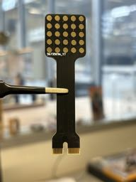

## Tactile Pop

A simple oral electrotaticle interface based on this [paper by Kurt Kaczmarek](https://www.sciencedirect.com/science/article/pii/S1026309811001702) and some inspiration from Cthulhu Shield by [Sapien LLC](http://sapienllc.com/). 

The basic setup is a shield for the Arduino Mega board, with an edge connector for attaching TDU electrodes. The electrode pop us is a PCB, so not certified for contact with the mouth: please use at your own risk! The pop should be coated with a food safe resin, leaving the electrodes exposed. Use gold coating on the electrode pcb for a safer surface coating. 

This repository contains firmware, patterns and Eagle project files for the Tactile Pop TDU. 





Repository layout
----------------
- `Code/` — Arduino sketches and supporting code.
  - `Patterns/` — pattern generator and example patterns (`Patterns.ino`).
  - `Screen/`, `Serial/` — alternative sketches and helpers for serial interface and an attached display. 
- `Electronics/` — Eagle project files and CAM outputs for the controller shield and the the pop TDU pcb. 

Quick start
-----------
1. Open the relevant Arduino sketch from `Code/` in the Arduino IDE .
2. Compile and upload to your compatible microcontroller.
3. Use the `Patterns` sketch or the serial interface to send patterns to the device.

Notes about Eagle files and git
-----------------------------
- Eagle generates backup/version files with `#` in their filenames (for example `Controller.b#1`) — these are ignored by the repository's `.gitignore` by default.
- Primary Eagle files (`*.sch`, `*.brd`) are kept under version control here. If you want to change what is ignored, edit the `.gitignore` in the project root.

Electrode stimulation 
----------------------

A number of parameters in the pulse patter can be changed, to give a range of intensity and qualities of sensation. Longer pulses will effect Nociceptors (prickly, needle like sensations), while shorter will tend to activate tactile receptors. Some stimulation of taste receptors is also possible.     

The the following parameters can be edited, and fine tuned for each individual electrode. 

PP[] — Pulse Period (microseconds). Total period of one inner pulse (high + low). Unit: µs.
Pp[] — Pulse-on time (microseconds). Time the pin is HIGH during one inner pulse. Unit: µs. 
IN[] — Inner burst count (integer). Number of inner pulses in one inner burst. 
IP[] — Inner burst pause (microseconds). Pause after each inner burst (time between inner bursts). 
ON[] — Outer burst count (integer). Number of inner bursts in one outer burst. 


Sensing Tongue Contact
----------------------

It's possible to sense tongue contact using ADC-capable pins, which is only the first three rows of the TDU. 
 
 ```C#
    const int sensingPins[5][5] = {
      {A1, A2, A3, A4, A5},
      {A6, A7, A8, A9, A10},
      {A11, A12, A13, A14, A15},
      {1, 2, 3, 4, 5},
      {6, 7, 8, 9, 10}
    };
 ```

The example below shows how you can also read a chanel, to check if the tongue is in contact with an electrode.  
 ```C#
    
    int baseLine = 800; 

    bool readSensing(int row, int col) {
      if (row < 0 || row >= 5 || col < 0 || col >= 5) return -1;
      int pin = sensingPins[row][col];
      return analogRead(pin);
        pinMode(pin, OUTPUT);
        digitalWrite(pin, HIGH);
        delayMicroseconds(400);
        pinMode(pin, INPUT);
        int response = analogRead(pin);
        delay(IntensityDelay);
        pinMode(pin, OUTPUT);
        digitalWrite(pin, LOW);
        return (response>baseLine);
    }

 ```

